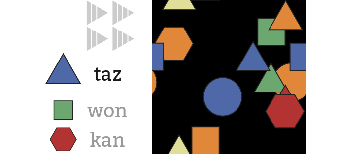

# zorpodnix

Zorpodnix is an experiment based on Incantasia, a memory game made during
Global Game Jam 2016 by [Lawrence Folland](https://github.com/lfolland),
[Chris Bruner](https://github.com/iplayfast), [Nick
Bruner](https://github.com/spood), and me.

Zorpodnix implements the memory-game mechanic conceived by Lawrence:
- a variety of shapes float across the playing area
- the player must click on a sequence of named shapes
- initially a legend shows the name of each shape
- the names gradually disappear from the legend
- the player must memorize the name of each shape to progress through the game

